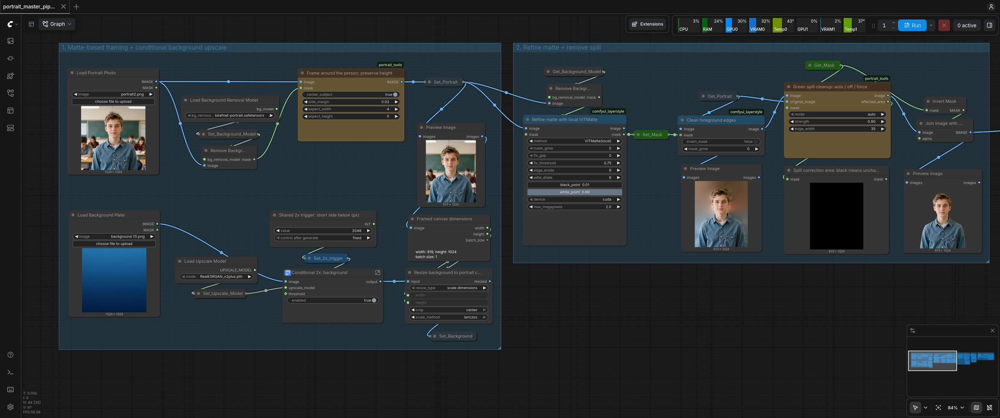
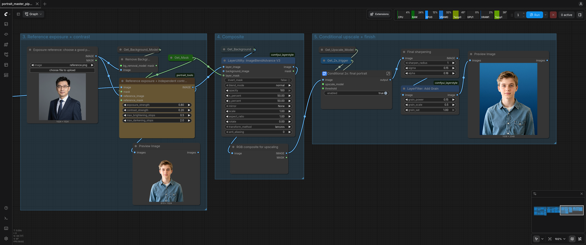

# Portrait Studio

Portrait workflow based on ComfyUI with a dedicated CLI batch tool.


---


## Install on a ComfyUI machine

1. Install ComfyUI and its normal Python environment. A Windows NVIDIA Portable [install](https://comfy.org/download) is the easiest dedicated workstation option.
2. Copy both directories from `custom_nodes/` into the ComfyUI `custom_nodes/` directory:

   ```text
   portrait_tools/
   comfyui_layerstyle/
   ```

3. In the ComfyUI Python environment, install the LayerStyle dependencies once:

   ```bash
   python -m pip install -r custom_nodes/comfyui_layerstyle/requirements.txt
   ```

   Restart ComfyUI after installing or updating custom nodes.

   Alternatively, you can install the entire LayerStyle extension from the [Manager](https://docs.comfy.org/manager/install), while the portrait_tools are made specifically for this workflow and need to be copied manually.

4. Put the model files listed in [`MODELS.md`](MODELS.md) in the matching ComfyUI `models/` folders. ComfyUI suggests the download link if the model is not present when trying to run the workflow. If you download the LayerStyle extension via the Manager you shouldn't need to install VITMatte manually.

5. Copy the UI workflow into ComfyUI's workflow folder or press Ctrl + o to open a workflow and Ctrl + s to save it, then you should be able to see if all the nodes and models resolve. In case of problems, the error panel on the right is very instructive and should be able to point you in the right direction.

   ```text
   ComfyUI/user/default/workflows/portrait_master_pipeline_v3.json
   ```

## Run a batch

Start ComfyUI first, for example:

```bash
python main.py --listen 127.0.0.1 --port 8188
```

If the model directory is kept outside the ComfyUI checkout, add `--models-directory /path/to/models` to that command.

On a multi-GPU machine you can start one ComfyUI instance per GPU and pass every URL to the batch tool:

```bash
python main.py --listen 127.0.0.1 --port 8188 --cuda-device 0
python main.py --listen 127.0.0.1 --port 8189 --cuda-device 1 \
  --database-url "sqlite:////path/to/ComfyUI/user/comfyui-8189.db"
```

Each instance loads its own copy of the models, so both GPUs need the full model set in VRAM. Also note the second instance must use a separate database: ComfyUI keeps state in `user/comfyui.db` (SQLite, single-writer), so two instances sharing the same user directory fail to start with a database lock error. The `--database-url` flag above points the second instance at its own file.

Then, from this project folder, run the batch tool. It accepts a portrait folder and one or more background files or folders:

```bash
python portrait_batch.py \
  --portraits /path/to/original_portraits \
  --backgrounds /path/to/backgrounds \
  --output /path/to/portrait_results \
  --comfy-url http://127.0.0.1:8188 http://127.0.0.1:8189
```

A single `--comfy-url` (or `$COMFY_URL`) still works for a one-GPU setup. If any job fails, the run continues on the remaining jobs and exits with a non-zero status.

The script writes files such as `portrait_name__background_name.png` to the output folder. With a single ComfyUI instance it processes every portrait/background combination sequentially; with multiple instances it runs one parallel worker per instance and each worker grabs the next unfinished job, so the two GPUs self-balance.

Add multiple backgrounds by listing them after `--backgrounds`, or by passing a folder containing them. An optional reference portrait for color correction can be supplied with `--reference`; when omitted, the portrait itself is used as the reference. Existing results are preserved with a numeric suffix instead of being overwritten.

The defaults are defined near the top of `portrait_batch.py` and can also be overridden for a run. For example:

```bash
python portrait_batch.py --portraits ./originals --backgrounds ./blue.png ./gray.png \
  --output ./results --reference ./reference.png \
  --aspect-width 1 --aspect-height 1 --no-background-upscale \
  --spill-strength 0.75
```

The batch tool uses only Python's standard library. It does not download models or make outbound internet requests. Apple Silicon can run the same workflow through a manual ComfyUI installation, but the current LayerStyle VITMatte path is configured for CUDA and falls back to CPU; an NVIDIA machine will be substantially faster.

## Updating the workflow

Make and test graph changes in ComfyUI, export the API workflow, and replace both files in `workflow/`. Keep the node IDs used by `portrait_batch.py` (`120`, `125`, `156`, `141:25`, `160:25`, `180`, `203`, and `46`) stable, or update the corresponding mappings in the script together with the workflow.
