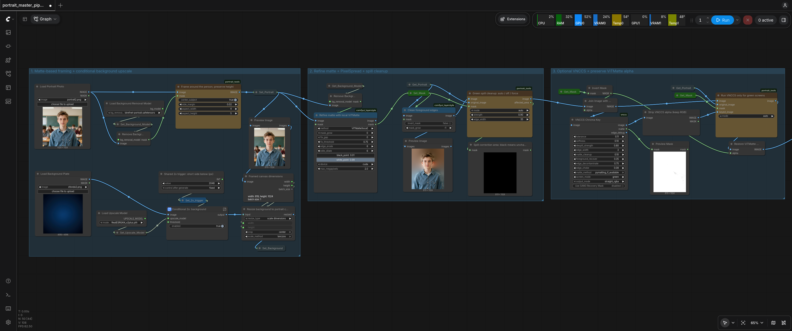
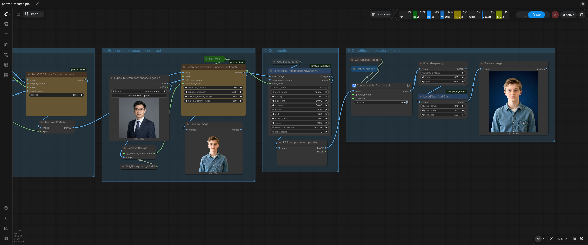

# Portrait Studio

Portrait workflow based on ComfyUI with a dedicated CLI batch tool.


---


## Installation

1. Install [ComfyUI](https://www.comfy.org/download) and enable [Manager](https://docs.comfy.org/manager/install) (in the Desktop version it is included and enabled by default).

2. Through Manager, install **ComfyUI LayerStyle**, **ComfyUI-KJNodes**, and **VNCCS – Visual Novel Character Creation Suite**. KJNodes provides the UI workflow's Set/Get nodes.

3. Stop ComfyUI and copy only `custom_nodes/portrait_tools` from this repo into `ComfyUI/custom_nodes/`. After the Manager installations finish, reinstall OpenCV contrib using ComfyUI's Python environment so its `cv2` files take precedence:

   ```bash
   python -m pip install --force-reinstall --no-deps opencv-contrib-python==4.14.0.94
   ```

   For Windows Portable, replace `python` with `.\python_embeded\python.exe` and run from the portable root. For a uv-managed environment without pip, use `uv pip install --python /path/to/ComfyUI/.venv/bin/python --reinstall --no-deps opencv-contrib-python==4.14.0.94`.

4. Restart ComfyUI and open `workflow/portrait_master_pipeline_v3.json`. Use missing-model download links where offered, or download the [model files](MODELS.md) into the specified folders under ComfyUI's configured `models/` directory. Restart ComfyUI after adding model files.

5. Select portrait, background, and reference images, then run the workflow. The portrait itself can also serve as the reference.

## Run a batch

Start ComfyUI first, for example:

```bash
python main.py --listen 127.0.0.1 --port 8188
```

On a multi-GPU machine you can start one ComfyUI instance per GPU and pass every URL to the batch tool:

```bash
python main.py --listen 127.0.0.1 --port 8188 --cuda-device 0
python main.py --listen 127.0.0.1 --port 8189 --cuda-device 1 \
  --database-url "sqlite:////path/to/ComfyUI/user/comfyui-8189.db"
```

Each instance manages its own model memory and offloading; VRAM is not pooled across GPUs. Use a separate database for the second instance to avoid database lock errors. The `--database-url` flag above points it at its own file.

Then, from this project folder, run the batch tool. It accepts a portrait folder and one or more background files or folders:

```bash
python portrait_batch.py \
  --portraits /path/to/original_portraits \
  --backgrounds /path/to/backgrounds \
  --output /path/to/portrait_results \
  --comfy-url http://127.0.0.1:8188 http://127.0.0.1:8189
```

A single `--comfy-url` (or `$COMFY_URL`) still works for a one-GPU setup. If any job fails, the run continues on the remaining jobs and exits with a non-zero status.

The script writes files such as `portrait_name__background_name.png` to the output folder. With a single ComfyUI instance it processes every portrait/background combination sequentially; with multiple instances it runs one parallel worker per instance and each worker grabs the next unfinished job, so the two GPUs self-balance.

Add multiple backgrounds by listing them after `--backgrounds`, or by passing a folder containing them. An optional reference portrait for color correction can be supplied with `--reference`; when omitted, the portrait itself is used as the reference. Existing results are preserved with a numeric suffix instead of being overwritten.

Add `--cutout` to also save each portrait without a background as `portrait_name__cutout.png` (PNG with transparent alpha). The cutout is the color-corrected matte result from before the background composite. It depends only on the portrait and the reference, so each portrait produces a single cutout shared across all of its background combinations; a rerun skips cutouts that already exist on disk.

The defaults are defined near the top of `portrait_batch.py` and can also be overridden for a run. For example:

```bash
python portrait_batch.py --portraits ./originals --backgrounds ./blue.png ./gray.png \
  --output ./results --reference ./reference.png \
  --aspect-width 1 --aspect-height 1 --no-background-upscale \
  --spill-strength 0.75
```

## RAW and HEIC/HEIF files

Install ImageMagick with libraw support for RAW and libheif support for HEIC/HEIF on the machine running the batch script. The `magick` executable must be on `PATH` (ImageMagick's `convert` is also supported).

RAW files (`.rw2`, `.cr2`, `.nef`, `.arw`, `.dng`, and other libraw formats) and `.heic`/`.heif` photos are accepted as portraits, backgrounds, or references, including uppercase extensions. They are converted locally with ImageMagick to 8-bit JPEG before upload. RAW decoding uses ImageMagick's existing camera white-balance behavior and quality 92 JPEG output.

HEIC/HEIF is a compressed photo format, not RAW. Conversion applies orientation and embedded color profiles, producing quality 95 sRGB JPEGs. JPEG conversion is lossy and does not retain HDR or auxiliary images.

Conversions are cached in `~/.cache/portrait_studio/raw` (override with `--input-cache-dir`). Cache keys include the full source path, size, and modification time, so different formats or folders with identical filenames do not share a conversion.

## Compatibility

The batch tool uses only Python's standard library. Apple Silicon can run the same workflow through a manual ComfyUI installation, but the current LayerStyle VITMatte path is configured for CUDA and falls back to CPU; an NVIDIA machine will be substantially faster.

## Updating the workflow

Make and test graph changes in ComfyUI, save the UI workflow and export its API version, then replace both files in `workflow/`. Keep the node IDs used by `portrait_batch.py` (`120`, `125`, `156`, `141:25`, `160:25`, `180`, `203`, `46`, `147`, and `207` for `--cutout`) stable, or update the corresponding mappings in the script together with the workflow. Node `147` provides the final image; node `207` is a `PreviewImage` wired to node `46` for the transparent cutout.
